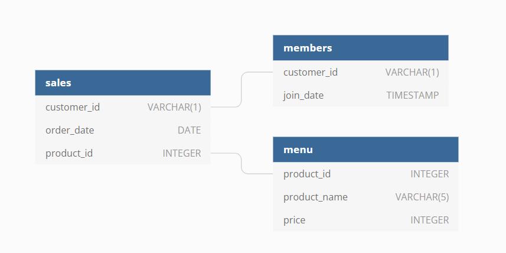

# Danny's Diner 

## Context

Danny seriously loves Japanese food so in the beginning of 2021, he decides to embark upon a risky venture and opens up a cute little restaurant that sells his 3 favourite foods: sushi, curry and ramen.

Danny’s Diner is in need of your assistance to help the restaurant stay afloat - the restaurant has captured some very basic data from their few months of operation but have no idea how to use their data to help them run the business.

## PEAR 
  - P - Problem
  - E - Exploration
  - A - Analysis
  - R - Result

<br>

## **Problem**

Danny wants to use the data to answer a few simple questions about his customers, especially about their visiting patterns, how much money they’ve spent and also which menu items are their favourite. Having this deeper connection with his customers will help him deliver a better and more personalised experience for his loyal customers.

He plans on using these insights to help him decide whether he should expand the existing customer loyalty program - additionally he needs help to generate some basic datasets so his team can easily inspect the data without needing to use SQL.

<br>

## ER Diagram

<br>
<p align="center">
  
</p>


## Exploration

### Sales Table

<br>

```sql

SELECT 
  *
FROM dannys_diner.sales;

```

<br>

| customer_id	| order_date	| product_id	|
| :---:| :---:| :---:|
|A|	2021-01-01	|1|
|A|	2021-01-01	|2|
|A|	2021-01-07	|2|
|A|	2021-01-10	|3|
|A|	2021-01-11	|3|
|A|	2021-01-11	|3|
|B|	2021-01-01	|2|
|B|	2021-01-02	|2|
|B|	2021-01-04	|1|
|B|	2021-01-11	|1|
|B|	2021-01-16	|3|
|B|	2021-02-01	|3|
|C|	2021-01-01	|3|
|C|	2021-01-01	|3|
|C|	2021-01-07	|3|

<br>

### Menu Table 

<br>

```sql

SELECT 
  *
FROM dannys_diner.menu;

```

<br>

| product_id	| product_name	| price	|
| :---:| :---:| :---:|
|1|	sushi|	10|
|1|	sushi|	10|
|2|	curry|	15|
|3|	ramen|	12|

<br>

### Members Table 


```sql

SELECT 
  *
FROM dannys_diner.members;

```

<br>

| customer_id	| join_date	|
| :---:| :---:|
|A	|2021-01-07|
|B	|2021-01-09|

<br>


### Analysis 

1. What is the total amount each customer spent at the restaurant?

<br>

```sql

SELECT
  s.customer_id,
  SUM(m.price) AS total_spent
FROM dannys_diner.sales s 
INNER JOIN dannys_diner.menu m 
on s.product_id = m.product_id
GROUP BY 1;

```

<br>

| customer_id	| total_spent	|
| :---:| :---:|
|A |76|
|B |74|
|C |36|

<br>

2. How many days has each customer visited the restaurant?

<br>

```sql
SELECT 
  customer_id,
  COUNT(DISTINCT order_date)
FROM dannys_diner.sales
GROUP BY 1;

```

<br>

| customer_id	| count	|
| :---:| :---:|
|A |4|
|B |6|
|C |2|

<br>

3. What was the first item from the menu purchased by each customer?

<br>

```sql
WITH order_sales AS 
  (SELECT 
    s.customer_id AS customer_id,
    s.order_date AS order_date,
    RANK() OVER (PARTITION BY s.customer_id ORDER BY s.order_date) AS ranks,
    m.product_id AS product_id,
    m.product_name AS product_name
  FROM dannys_diner.sales s 
  INNER JOIN dannys_diner.menu m 
  ON s.product_id = m. product_id) 
  
SELECT 
  DISTINCT customer_id,
  order_date,
  product_name
FROM order_sales
WHERE ranks = 1;

```
| customer_id	| order_date	| product_name |
| :---:| :---:| :---:|
|A| 2021-01-01| curry|
|A| 2021-01-01| sushi|
|B| 2021-01-01| curry|
|C| 2021-01-01| ramen|

<br>

4. What is the most purchased item on the menu and how many times was it purchased by all customers?

<br>

```sql
SELECT 
  m.product_name,
  COUNT(*)
FROM dannys_diner.sales s 
INNER JOIN dannys_diner.menu m 
ON s.product_id = m.product_id
GROUP BY 1
LIMIT 1;

-- Logic 2 

WITH cte_products AS (
SELECT 
  m.product_name AS product_name,
  COUNT(*) as product_counts,
  RANK() OVER(ORDER BY COUNT(*) DESC) p_rank
FROM dannys_diner.sales s 
INNER JOIN dannys_diner.menu m 
ON s.product_id = m.product_id
GROUP BY 1)

SELECT 
  product_name,
  product_counts
FROM cte_products 
WHERE p_rank = 1;

```

<br>

| customer_id	| order_date	|
| :---:| :---:|
| ramen | 8 |

<br>

5. Which item was the most popular for each customer?

<br>

```sql
WITH popular AS 
  (SELECT 
    s.customer_id,
    m.product_name,
    COUNT(*),
    RANK() OVER (PARTITION BY s.customer_id ORDER BY COUNT(*) DESC) ranks
  FROM dannys_diner.sales s 
  INNER JOIN dannys_diner.menu m 
  ON s.product_id = m.product_id
  GROUP BY 1,2)

SELECT 
  *
FROM popular
WHERE ranks = 1
;

```
| customer_id | product_name | count | ranks |
| :---:| :---:| :---:| :---:|
|A| ramen| 3| 1|
|B| sushi| 2| 1|
|B| curry| 2| 1|
|B| ramen| 2| 1|
|C| ramen| 3| 1|

<br>

6. Which item was purchased first by the customer after they became a member?

<br>

```sql
WITH first_purchase AS 
  (SELECT 
    s.customer_id AS customer_id,
    s.order_date AS order_date,
    s.product_id,
    me.product_name AS product_name,
    RANK() OVER (PARTITION BY s.customer_id ORDER BY s.order_date) ranks
  FROM dannys_diner.sales s 
  INNER JOIN dannys_diner.members m 
  ON s.customer_id = m.customer_id 
  INNER JOIN dannys_diner.menu me 
  ON me.product_id = s.product_id
  WHERE m.join_date <= s.order_date)

SELECT 
  customer_id,
  order_date,
  product_name
FROM first_purchase 
WHERE ranks = 1
;

```

<br>
| customer_id | order_date | product_name |
| :---:| :---:| :---:|
|A| 2021-01-07| curry|
|B| 2021-01-11| sushi|

<br>

7. Which item was purchased just before the customer became a member?

<br>

```sql
WITH first_purchase AS 
  (SELECT 
    s.customer_id AS customer_id,
    s.order_date AS order_date,
    s.product_id,
    me.product_name AS product_name,
    RANK() OVER (PARTITION BY s.customer_id ORDER BY s.order_date DESC) ranks
  FROM dannys_diner.sales s 
  INNER JOIN dannys_diner.members m 
  ON s.customer_id = m.customer_id 
  INNER JOIN dannys_diner.menu me 
  ON me.product_id = s.product_id
  WHERE m.join_date > s.order_date)

SELECT 
  customer_id,
  order_date,
  product_name
FROM first_purchase 
WHERE ranks = 1
;

```

<br>

| customer_id | order_date | product_name |
| :---:| :---:| :---:|
|A| 2021-01-01 |sushi|
|A| 2021-01-01 |curry|
|B| 2021-01-04 |sushi|

<br>

8. What is the total items and amount spent for each member before they became a member?

<br>

```sql
SELECT 
  m.customer_id,
  COUNT(DISTINCT s.product_id),
  SUM(me.price)
FROM dannys_diner.sales s 
INNER JOIN dannys_diner.members m 
ON s.customer_id = m.customer_id 
INNER JOIN dannys_diner.menu me 
ON me.product_id = s.product_id 
WHERE m.join_date > s.order_date
GROUP BY 1;
```

<br>

| customer_id | count | sum |
| :---:| :---:| :---:|
|A| 2| 25|
|B| 2| 40|

<br>


9. If each $1 spent equates to 10 points and sushi has a 2x points multiplier - how many points would each customer have?

<br>

```sql
SELECT 
  s.customer_id,
  SUM(CASE WHEN m.product_name = 'sushi' THEN 2*10*m.price 
      ELSE 10 * m.price END) AS points
FROM dannys_diner.sales s 
INNER JOIN dannys_diner.menu m 
ON s.product_id = m.product_id
GROUP BY 1
ORDER BY 1; 

```

<br>

| customer_id | points |
| :---:| :---:|
|A| 860|
|B| 940|
|C| 360|

<br>


10. In the first week after a customer joins the program (including their join date) they earn 2x points on all items, not just sushi - how many points do customer A and B have at the end of January?

<br>

```sql
SELECT 
  s.customer_id,
  SUM(
      CASE 
          WHEN m.product_name = 'sushi' THEN 2*10*m.price 
           WHEN s.order_date BETWEEN me.join_date::DATE AND (me.join_date::DATE+6) THEN 2 * 10 * m.price
           ELSE 10* m.price
      END
      ) AS points
FROM dannys_diner.sales s 
INNER JOIN dannys_diner.menu m 
ON s.product_id = m.product_id 
INNER JOIN dannys_diner.members me 
ON me.customer_id = s.customer_id 
WHERE s.order_date <= '2021-01-31'::DATE
GROUP BY 1
ORDER BY 2;
```

<br>
| customer_id | points |
| :---:| :---:|
| B | 820 |
|A | 1370 |
