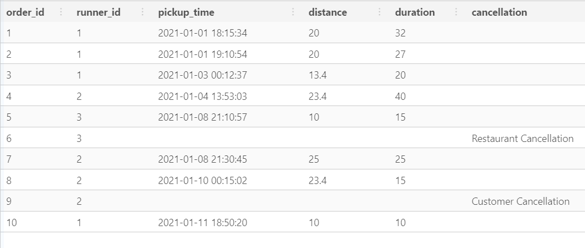

# Pizza Runner 


## Context 

Danny was scrolling through his Instagram feed when something really caught his eye - “80s Retro Styling and Pizza Is The Future!”

Danny was sold on the idea, but he knew that pizza alone was not going to help him get seed funding to expand his new Pizza Empire - so he had one more genius idea to combine with it - he was going to Uberize it - and so Pizza Runner was launched!

Danny started by recruiting “runners” to deliver fresh pizza from Pizza Runner Headquarters (otherwise known as Danny’s house) and also maxed out his credit card to pay freelance developers to build a mobile app to accept orders from customers.


## ER Diagram 


<br>
<p align="center">
  
</p>

<br>


## PEAR 
  - P - Problem
  - E - Exploration
  - A - Analysis
  - R - Result

<br>

## **Problem**

Danny wants to see and analye how Uberizing the whole chain of Pizza would affect his business. He also wants to answer a lot of questions about his developed strategy.
He plans on deciding whether or not he should invest more in this business.


## **Exploration**

### Runners Table

<br>

```sql

SELECT 
  *
FROM pizza_runner.runners
LIMIT 10;

```

<br>


| runner_id	| registration_date	| 
| :---:| :---:| 
|1| 2021-01-01 |
|2| 2021-01-03|
|3| 2021-01-08|
|4| 2021-01-15|

<br>

### Customer Orders Table

<br>

```sql

SELECT 
  *
FROM pizza_runner.customer_orders
LIMIT 10;

```

<br>

| order_id	| customer_id	| pizza_id	| exclusions	| extras	| order_time |
| :---:| :---:| :---:| :---:| :---:| :---:| 
|1|	101|	1|		|	|2021-01-01 18:05:02|
|2|	101|	1|		|	|2021-01-01 19:00:52|
|3|	102|	1|		|	|2021-01-02 23:51:23|
|3|	102|	2|		|NaN|	2021-01-02 23:51:23|
|4|	103|	1|	4|		|2021-01-04 13:23:46|
|4|	103|	1|	4|		|2021-01-04 13:23:46|
|4|	103|	2|	4|		|2021-01-04 13:23:46|
|5|	104|	1|	null|	1|	2021-01-08 21:00:29|
|6|	101|	2|	null|	null|	2021-01-08 21:03:13|
|7|	105|	2|	null|	1	|2021-01-08 21:20:29|
|8|	102|	1|	null|	null|	2021-01-09 23:54:33|
|9|	103|	1|	4|	1, 5	|2021-01-10 11:22:59|
|10|	104|	1|	null|	null|	2021-01-11 18:34:49|
|10|	104|	1|	2, 6|	1, 4	|2021-01-11 18:34:49|


<br>

We can see that there are a lot of nulls values and also missing values. We will have to treat these.


```sql

DROP TABLE IF EXISTS customer_orders_temp;
CREATE TEMP TABLE customer_orders_temp AS 
  (SELECT 
    order_id,
    customer_id,
    pizza_id,
    CASE 
      WHEN exclusions IS NULL or exclusions like '%null' THEN ''
      ELSE exclusions
    END AS exclusions,
    CASE 
      WHEN extras IS NULL or extras like '%null' THEN ''
      ELSE extras
    END AS extras,
    order_time
  FROM pizza_runner.customer_orders);

SELECT 
  *
FROM customer_orders_temp;

```

<br>

<br>
<p align="center">
  
</p>

<br>

### Runner Orders Table 

<br>

```sql

SELECT 
  *
FROM pizza_runner.runner_orders;


```

<br>

|order_id	|runner_id	|pickup_time	|distance|	duration	|cancellation|
| :---:| :---:| :---:| :---:| :---:| :---:| 
|1|	1|	2021-01-01 18:15:34|	20km|	32 minutes| |	
|2|	1|	2021-01-01 19:10:54|	20km|	27 minutes| |	
|3|	1|	2021-01-03 00:12:37|	13.4km|	20 mins|	NaN |
|4|	2|	2021-01-04 13:53:03|	23.4|	40|	NaN|
|5|	3|	2021-01-08 21:10:57|	10|	15|	NaN|
|6|	3|	null|	null|	null|	Restaurant Cancellation|
|7|	2|	2020-01-08 21:30:45|	25km|	25mins|	null|
|8|	2|	2020-01-10 00:15:02|	23.4 km|	15 minute|	null|
|9|	2|	null|	null|	null|	Customer Cancellation|
|10|	1|	2020-01-11 18:50:20|	10km|	10minutes|	null|


<br>

From the above data we can observe that there are many missing values, NaN values and null values that need to be treated.
Hence we will clean this table.

<br>

```sql

DROP TABLE IF EXISTS runner_orders_temp;
CREATE TEMP TABLE runner_orders_temp AS 
  (SELECT 
    order_id,
    runner_id,
    CASE 
      WHEN pickup_time like 'null' or pickup_time IS NULL THEN '' ELSE pickup_time 
    END AS pickup_time,
    CASE 
      WHEN distance like 'null' or distance IS NULL THEN '' 
      WHEN distance like '%km' THEN TRIM('km' FROM distance) 
      ELSE distance
    END AS distance,
    CASE 
      WHEN duration like 'null' or duration IS NULL THEN ''  
      WHEN duration like '%mins' THEN TRIM('mins' FROM duration)
      WHEN duration like '%minute' THEN TRIM('minute' FROM duration)
      WHEN duration like '%minutes' THEN TRIM('minutes' FROM duration)
      ELSE duration
    END AS duration,
    CASE WHEN cancellation IS NULL OR cancellation= 'null' THEN '' ELSE cancellation END AS cancellation
  FROM pizza_runner.runner_orders);
  

SELECT 
  *
FROM runner_orders_temp;

```


<br>
<p align="center">
  
</p>

<br>
