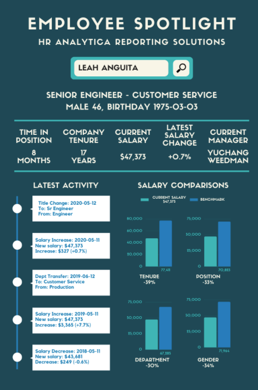
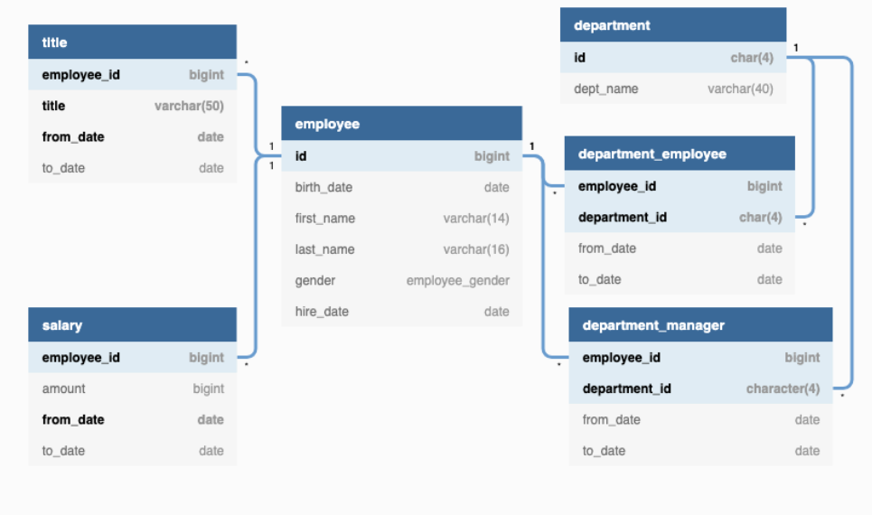

# **HR Analytics - PEAR**

## PEAR
  - P - Problem
  - E - Exploration
  - A - Analysis
  - R - Result

<br>

## **Problem**

* We have been asked by the HR Analytica to generate reusable datasets to power 2 HR analytics tools.
* Generate database views that HR Analytica will use for 2 key dashboards - reporting solutions and ad-hoc analytics requests. 
* Also fix the date related fields.

<br>

## Required Insights 

* The following insights must be generated for the 2 dashboards as requested by HR Analytica.

<br>

## Company Level

### Splitting by gender - current snapshot

* Total number of employees
* Average company tenure in years
* Average latest payrise percentage
* Statistical metrics for salary values including: ```MEAN```, ```MAX```, ```STDDEV```, Inter quartile range and median.


<br>

## Department Level

* Similar to company level, just at department level that includes additional department levek tenure metrics split by gender.

<br>


## Title level

* Siilar to department level but a little level of granularity.

<br>

## Deep diving on the employee relation

* Highlight recent event for every single employee form time to time.
* See all the various employment history ordered by effective date including salary, department, manager and title changes
* Calculate previous historic payrise percentages and value changes
* Calculate the previous position and department history in months with start and end dates
* Compare an employee’s current salary, total company tenure, department, position and gender to the average benchmarks for their current position

<br>

## Outputs

### Current snapshot reporting

<br>
<p align="center">
  
</p>

### Historic Employee Deep Dive 

<br>
<p align="center">
  
</p>

<br>


## Exploration

### ER Diagram 

<br>
<p align="center">
  
</p>

<br>


## Data Exploration

* Exploring the schema ```employees``` by accessing ```pg_indexes``` to get the index information.

<br>

```sql
SELECT *
FROM pg_indexes
WHERE schemaname = 'employees';

```

<br>

| schemaname	| tablename	| indexname	| indexdef  |
| :---:| :---:| :---:| :---:|
|employees|	employee|	idx_16988_primary|	CREATE UNIQUE INDEX idx_16988_primary ON employees.employee USING btree (id)|
|employees|	department_employee|	idx_16982_primary|	CREATE UNIQUE INDEX idx_16982_primary ON employees.department_employee USING btree (employee_id, department_id)|
|employees|	department_employee|	idx_16982_dept_no|	CREATE INDEX idx_16982_dept_no ON employees.department_employee USING btree (department_id)|
|employees|	department|	idx_16979_primary|	CREATE UNIQUE INDEX idx_16979_primary ON employees.department USING btree (id)|
|employees|	department|	idx_16979_dept_name|	CREATE UNIQUE INDEX idx_16979_dept_name ON employees.department USING btree (dept_name)|
|employees|	department_manager|	idx_16985_primary|	CREATE UNIQUE INDEX idx_16985_primary ON employees.department_manager USING btree (employee_id, department_id)|
|employees|	department_manager|	idx_16985_dept_no|	CREATE INDEX idx_16985_dept_no ON employees.department_manager USING btree (department_id)|
|employees|	salary|	idx_16991_primary|	CREATE UNIQUE INDEX idx_16991_primary ON employees.salary USING btree (employee_id, from_date)|
|employees|	title|	idx_16994_primary|	CREATE UNIQUE INDEX idx_16994_primary ON employees.title USING btree (employee_id, title, from_date)|

<br>

From the above table we can observe that:
1. The following tables have unique indexes on a single column:
    * ```employees.employee```
    * ```employees.department```

2. The rest of the tables have multiple records for ```employee_id``` values.
    * ```employees.department_employee```
    * ```employees.department_manager```
    * ```employee.salary```
    * ```employee.title```
 
##  Individual Table Analysis

### Employee Table

* Confirming whether there is a single record per employee.

<br>

```sql

with cte AS  
  (SELECT 
    id,
    COUNT(*) as row_count
  FROM employees.employee
  GROUP BY id)
SELECT
  row_count,
  COUNT(DISTINCT id) as employee_count
FROM cte 
GROUP BY 1
ORDER BY 1;

```

<br>

| row_count	| employee_count|
| :---:| :---:|
| 1 | 300024|

<br>

### Department Table 

* There are 9 unique departments 

<br>

```sql

SELECT 
  *
FROM employees.department;

```

| id	| dept_name|
| :---:| :---:|
|d001|	Marketing|
|d002|	Finance|
|d003|	Human Resources|
|d004|	Production|
|d005|	Development|
|d006|	Quality Management|
|d007|	Sales|
|d008|	Research|
|d009|	Customer Service|

<br>

### Department Employee table 

```sql

SELECT 
  *
FROM employees.department_employee
LIMIT 5;

```

| employee_id	| department_id| from_date	| to_date|
| :---:| :---:| :---:| :---:|
|10001|	d005|	1986-06-26|	9999-01-01|
|10002|	d007|	1996-08-03|	9999-01-01|
|10003|	d004|	1995-12-03|	9999-01-01|
|10004|	d004|	1986-12-01|	9999-01-01|
|10005|	d003|	1989-09-12|	9999-01-01|


<br>

* In the ```department_employee``` table we have a column named ```to_date = '9999-01-01'``` 
* Lets investigate the distribution of the ```to_date``` column.

<br>

```sql

SELECT 
  to_date,
  COUNT(*) as record_count
FROM employees.department_employee
GROUP BY 1
ORDER BY 1 DESC
LIMIT 5;

```

<br>

| to_date	| record_count|
| :---:| :---:|
|9999-01-01|	240124|
|2000-04-14|	48|
|2000-03-29|	46|
|2001-02-10|	46|
|1999-12-06|	45|

<br>

* We see that there are many values related to ```to_date```. We have many values for ```9999-01-01```. 
* Now let's confirm that we have a many-to-one relationship between ```department_employee``` and its ```employee_id```


```sql

with employee_id_cte AS 
  (SELECT 
    employee_id,
    COUNT(*) as row_count
  FROM employees.department_employee
  GROUP BY 1)
SELECT 
  row_count,
  COUNT(DISTINCT employee_id) as employee_count 
FROM employee_id_cte
GROUP BY 1 
ORDER BY 1 DESC;

```

* We can see that there are approximately 10% rows with 2 records. i.e. there are multiple records per ```employee_id```


### Department manager table

```sql 

SELECT 
FROM employees.department_manager
LIMIT 5;

```

<br>

| employee_id	| department_id| from_date	| to_date|
| :---:| :---:| :---:| :---:|
|110022|	d001|	1985-01-01|	1991-10-01|
|110039|	d001|	1991-10-01|	9999-01-01|
|110085|	d002|	1985-01-01|	1989-12-17|
|110114|	d002|	1989-12-17|	9999-01-01|
|110183|	d003|	1985-01-01|	1992-03-21|

<br>

* Investigating ```to_date``` column 

<br>

```sql

SELECT 
  to_date,
  COUNT(*) as record_count
FROM employees.department_manager
GROUP BY 1
ORDER BY 2 DESC;

```
<br>

| to_date	| record_count|
| :---:| :---:|
|9999-01-01|	9|
|1994-06-28|	1|
|1991-09-12|	1|
|1992-04-25|	1|
|1991-03-07|	1|
|1992-03-21|	1|
|1991-10-01|	1|
|1992-08-02|	1|
|1988-10-17|	1|
|1996-01-03|	1|
|1988-09-09|	1|
|1991-04-08|	1|
|1989-05-06|	1|
|1989-12-17|	1|
|1996-08-30|	1|
|1992-09-08|	1|

<br>

* Confirming rows per ```employee_id```

<br>

```sql

WITH employee_id_cte AS 
  (SELECT 
    employee_id,
    COUNT(*) as row_count
  FROM employees.department_manager
  GROUP BY 1)
SELECT 
  row_count,
  COUNT(DISTINCT employee_id) AS employee_count
FROM employee_id_cte 
GROUP BY 1
ORDER BY 1 DESC;

```

<br>

| to_date	| record_count|
| :---:| :---:|
| 1 | 24 |

* From the above query we can see that each ```employee_id``` that appears in ```empoyees.department_manager``` table will have only have a single record or a one-to-one relationship.


### Salary Table 

* Salary table comprises of salary of an employee over time. 

<br>

```sql 

SELECT 
  *
FROM employees.salary
WHERE employee_id = 100001
ORDER BY from_date DESC;

```

<br>

| employee_id	| amount| from_date | to_date |
| :---:| :---:| :---:| :---:|
|10001|	88958|	2002-06-22|	9999-01-01|
|10001|	85097|	2001-06-22|	2002-06-22|
|10001|	85112|	2000-06-22|	2001-06-22|
|10001|	84917|	1999-06-23|	2000-06-22|
|10001|	81097|	1998-06-23|	1999-06-23|
|10001|	81025|	1997-06-23|	1998-06-23|
|10001|	80013|	1996-06-23|	1997-06-23|
|10001|	76884|	1995-06-24|	1996-06-23|
|10001|	75994|	1994-06-24|	1995-06-24|
|10001|	75286|	1993-06-24|	1994-06-24|
|10001|	74333|	1992-06-24|	1993-06-24|
|10001|	71046|	1991-06-25|	1992-06-24|
|10001|	66961|	1990-06-25|	1991-06-25|
|10001|	66596|	1989-06-25|	1990-06-25|
|10001|	66074|	1988-06-25|	1989-06-25|
|10001|	62102|	1987-06-26|	1988-06-25|
|10001|	60117|	1986-06-26|	1987-06-26|

<br>

* Investigative the ```to_date``` column 

```sql

SELECT 
  to_date,
  COUNT(*) as record_count,
  COUNT(DISTINCT employee_id) as employee_count
FROM employees.salary
GROUP BY 1 
ORDER BY 1 DESC
LIMIT 5;

```

<br>

| employee_id	| amount| from_date |
| :---:| :---:| :---:|
|9999-01-01|	240124|	240124|
|2020-08-01|	686|	686|
|2020-07-31|	641|	641|
|2020-07-30|	673|	673|
|2020-07-29|	679|	679|

<br>

* Checking for duplicate ```employee_id```

<br>

```sql

WITH employee_id_cte AS 
  (SELECT 
    employee_id,
    COUNT(*) as row_count
  FROM employees.salary
  GROUP BY 1)
SELECT
  row_count,
  COUNT(DISTINCT employee_id) as employee_count
FROM employee_id_cte
GROUP BY 1
ORDER BY 1 DESC;

```

<br>

| row_count	| employee_count|
| :---:| :---:|
|18|	8180|
|17|	16106|
|16|	16331|
|15|	16799|
|14|	17193|
|13|	17318|
|12|	17530|
|11|	17952|
|10|	18474|
|9|	18815|
|8|	19281|
|7|	19715|
|6|	20403|
|5|	21335|
|4|	22038|
|3|	15784|
|2|	8361|
|1|	8409|

<br>

* From the above table we can observe that there are more than one record per employee for majority of the records. We need to be careful while joining.

## Analysis 

#### Splitting the SQL solution into following parts
   
   1. Data Cleaning and Date Adjustments
   2. Current Snapshot Analysis 
   3. Historical Analysis 
    

## 1. Data Cleaning

* First we will have to adjust all the date firlds identified by HR Analytica
* Incrementing all of the date fileds except the end date ```9999-01-01``` 
* Also cast the ```DATE``` to ```TIMESTAMP``` to keep the data original and as similar as possible.
* Creating materialized views with same original tables 

<br>


```sql

DROP SCHEMA IF EXISTS mv_employees CASCADE;
CREATE SCHEMA mv_employees;


-- department 

DROP MATERIALIZED VIEW IF EXISTS mv_employees.department;
CREATE MATERIALIZED VIEW mv_employees.department AS 
SELECT 
  *
FROM employees.department;


--department employee 


DROP MATERIALIZED VIEW IF EXISTS mv_employees.department_employee;
CREATE MATERIALIZED VIEW mv_employees.department_employee AS 
SELECT 
  employee_id,
  department_id,
  (from_date + interval '18 years')::DATE as from_date,
  CASE 
    WHEN to_date <> '9999-01-01' THEN (to_date + interval '18 years')::DATE
    ELSE to_date 
    END AS to_date
FROM employees.department_employee;


-- department_manager 


DROP MATERIALIZED VIEW IF EXISTS mv_employees.department_manager;
CREATE MATERIALIZED VIEW mv_employees.department_manager AS 
SELECT 
  employee_id,
  department_id,
  (from_date + interval '18 years')::DATE as from_date,
  CASE 
    WHEN to_date <> '9999-01-01' THEN (to_date + interval '18 years')::DATE
    ELSE to_date 
    END AS to_date
FROM employees.department_manager;


-- employee 

DROP MATERIALIZED VIEW IF EXISTS mv_employees.employee;
CREATE MATERIALIZED VIEW mv_employees.employee AS 
SELECT 
  id,
  (birth_date + interval '18 years')::DATE as birth_date,
  first_name,
  last_name,
  gender,
  (hire_date + interval '18 years')::DATE as hire_date
FROM employees.employee;


-- salary 


DROP MATERIALIZED VIEW IF EXISTS mv_employees.salary;
CREATE MATERIALIZED VIEW mv_employees.salary AS 
SELECT 
  employee_id,
  amount,
  (from_date + interval '18 years')::DATE AS from_date,
  CASE 
    WHEN to_date <> '9999-01-01' THEN (to_date + interval '18 years')::DATE 
    ELSE to_date 
    END AS to_date
FROM employees.salary;


-- title 

DROP MATERIALIZED VIEW IF EXISTS mv_employees.title;
CREATE MATERIALIZED VIEW mv_employees.title AS 
SELECT 
  employee_id,
  title,
  (from_date + interval '18 years' )::DATE AS from_date,
  CASE 
    WHEN to_date <> '9999-01-01' THEN (to_date + interval '18 years')::DATE 
    ELSE to_date 
    END AS to_date
FROM employees.title;


-- Creating indexes 


CREATE UNIQUE INDEX ON mv_employees.employee USING btree (id);
CREATE UNIQUE INDEX ON mv_employees.department_employee USING btree (employee_id, department_id);
CREATE INDEX        ON mv_employees.department_employee USING btree (department_id);
CREATE UNIQUE INDEX ON mv_employees.department USING btree (id);
CREATE UNIQUE INDEX ON mv_employees.department USING btree (dept_name);
CREATE UNIQUE INDEX ON mv_employees.department_manager USING btree (employee_id, department_id);
CREATE INDEX        ON mv_employees.department_manager USING btree (department_id);
CREATE UNIQUE INDEX ON mv_employees.salary USING btree (employee_id, from_date);
CREATE UNIQUE INDEX ON mv_employees.title USING btree (employee_id, title, from_date);

```

<br>

### Current Snapshot Analysis
    
* We will create a snapshot view whoch we will use as a base for each of the aggregated layers for different dashboard outputs.
    
#### Analysis Plan

1. Apply LAG window functions on the ```salary``` materialized view to obtain the latest ```previous_salary``` value, keeping only current valid records with ```to_date = '9999-01-01'```
2. Join previous salary and all other required information from the materialized views for the dashboard analysis (omitting the department_manager view)
3. Apply ```WHERE``` filter to keep only current records
4. Make sure to include the ```gender``` column from the ```employee``` view for all calculations
5. Use the ```hire_date``` column from the ```employee``` view to calculate the number of tenure years
6. Include the ```from_date``` columns from the ```title``` and ```department``` are included to calculate tenure
7. Use the ```salary``` table to calculate the current average salary
8. Include ```department``` and ```title``` information for additional group by aggregations
9. Implement the various statistical measures for the salary amount
10. Combine all of these elements into a single final current snapshot view
    

#### Current Employee Snapshot 


```sql

DROP VIEW IF EXISTS mv_employees.current_employee_snapshot CASCADE;
CREATE VIEW mv_employees.current_employee_snapshot AS 
WITH cte_previous_salary AS   
  (SELECT
    *
  FROM 
    (SELECT 
      employee_id,
      to_date,
      LAG(amount) OVER (PARTITION BY employee_id ORDER BY from_date) AS amount
    FROM mv_employees.salary) all_salaries
  WHERE to_date = '9999-01-01'),
cte_joined_data AS
  (SELECT 
    e.id as employee_id,
    e.gender,
    e.hire_date,
    t.title,
    s.amount as salary,
    p.amount as previous_salary,
    d.dept_name as department,
    t.from_date as title_from_date,
    dp.from_date as department_from_date
  FROM mv_employees.employee e  
  INNER JOIN mv_employees.title t 
  ON e.id = t.employee_id 
  INNER JOIN mv_employees.salary s 
  ON e.id = s.employee_id 
  INNER JOIN cte_previous_salary p 
  ON e.id = p.employee_id 
  INNER JOIN mv_employees.department_employee dp 
  ON e.id = dp.employee_id 
  INNER JOIN mv_employees.department d 
  ON dp.department_id = d.id 
  WHERE s.to_date = '9999-01-01' AND t.to_date = '9999-01-01' and dp.to_date = '9999-01-01'),
final_output AS 
(SELECT 
  employee_id,
  gender,
  title,
  salary,
  department,
  ROUND(100*(salary - previous_salary) / (previous_salary)::NUMERIC,2) AS salary_percentage_change,
  DATE_PART('year',now()) - DATE_PART('year',hire_date) AS company_tenure_years,
  DATE_PART('year',now()) - DATE_PART('year',title_from_date) AS title_tenure_years,
  DATE_PART('year',now()) - DATE_PART('year',department_from_date) AS department_tenure_years
FROM cte_joined_data)
SELECT 
  *
FROM final_output;


SELECT 
  * 
FROM mv_employees.current_employee_snapshot 
LIMIT 5;

```

<br>

| employee_id	| gender| title	| salary| department	| salary_percentage_change| company_tenure_years	| title_tenure_years| department_tenure_years	| 
| :---:| :---:| :---:| :---:| :---:| :---:| :---:| :---:| :---:|
|10001|	M|	Senior Engineer|	88958|	Development|	4.54|	17|	17|	17|
|10002|	F|	Staff|	72527|	Sales|	0.78|	18|	7|	7|
|10003|	M|	Senior Engineer|	43311|	Production|	-0.89|	17|	8|	8|
|10004|	M|	Senior Engineer|	74057|	Production|	4.75|	17|	8|	17|
|10005|	M|	Senior Staff|	94692|	Human Resources|	3.54|	14|	7|	14|

<br>


