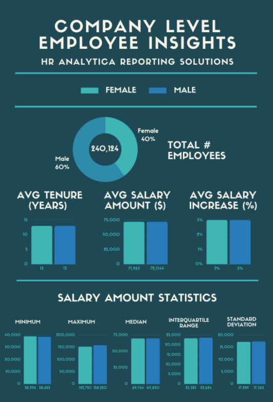

# **HR Analytics - PEAR**

## PEAR
  - P - Problem
  - E - Exploration
  - A - Analysis
  - R - Result

<br>

## **Problem**

* We have been asked by the HR Analytica to generate reusable datasets to power 2 HR analytics tools.
* Generate database views that HR Analytica will use for 2 key dashboards - reporting solutions and ad-hoc analytics requests. 
* Also fix the date related fields.

<br>

### Required Insights 

* The following insights must be generated for the 2 dashboards as requested by HR Analytica.

<br>

#### Company Level

##### Splitting by gender - current snapshot

* Total number of employees
* Average company tenure in years
* Average latest payrise percentage
* Statistical metrics for salary values including: ```MEAN```, ```MAX```, ```STDDEV```, Inter quartile range and median.


<br>

#### Department Level

* Similar to company level, just at department level that includes additional department levek tenure metrics split by gender.

<br>


#### Title level

* Siilar to department level but a little level of granularity.

<br>

#### Deep diving on the employee relation

* Highlight recent event for every single employee form time to time.
* See all the various employment history ordered by effective date including salary, department, manager and title changes
* Calculate previous historic payrise percentages and value changes
* Calculate the previous position and department history in months with start and end dates
* Compare an employee’s current salary, total company tenure, department, position and gender to the average benchmarks for their current position

<br>

#### Outputs

#### Current snapshot reporting

<br>
<p align="center">
  
</p>

