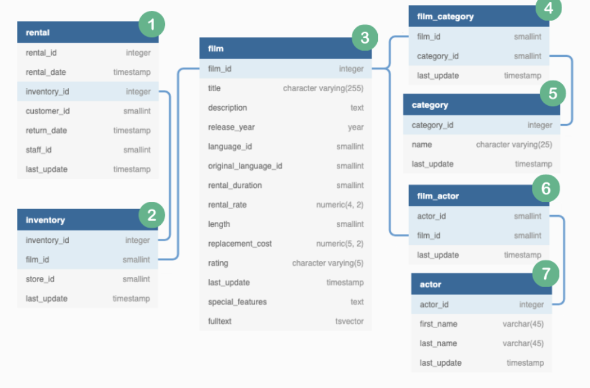

# **Marketing Analytics - PEAR**

## PEAR
  - P - Problem
  - E - Exploration
  - A - Analysis
  - R - Result


## **Problem**

* We have been asked by the DVD Rental Co marketing team to generate analytical inputs for their customer marketing campaign.
* They want to send out personalised emails to every customer.
* Main initiative - Each customer's viewing behaviour
* Key statiistics: Each customers's top 2 categories and favorite actor.
* There are also 3 personalised recommendations based off each customer's previous viewing history.


## Email Tempelate for presonalised recommendations 

<br>
<p align="center">
  
</p>

<br>

## Category Insights

#### Top Category:
1. What was the top category watched by total rental count?
2. How many total films have they watched in their top category and how does it compare to the DVD Rental Co customer base?
3. How many more films has the customer watched compared to the average DVD Rental Co customer?
4. How does the customer rank in terms of the top X% compared to all other customers in this film category?
5. What are the top 3 film recommendations in the top category ranked by total customer rental count which the customer has not seen before?

#### Second Category
1. What is the second ranking category by total rental count?
2. What proportion of each customer’s total films watched does this count make?
3. What are top 3 recommendations for the second category which the customer has not yet seen before?

#### Actor Insights 
1. Which actor has featured in the customer’s rental history the most?
2. How many films featuring this actor has been watched by the customer?
3. What are the top 3 recommendations featuring this same actor which have not been watched by the customer?


<br>

## ER Diagram 
<br>
<p align="center">
  
</p>

<br>

## Exploration

1. Perform an anti join to check which column values exist in ```dvd_rentals.rental``` but not in ```dvd_rentals.inventory``` <br>

```sql
-- left table

SELECT 
  count(DISTINCT rental.inventory_id)
FROM dvd_rentals.rental
WHERE NOT EXISTS
  (SELECT
    inventory_id
  FROM dvd_rentals.inventory
  WHERE rental.inventory_id = inventory.inventory_id);
  
```
<br>

| count  |
| :----:|
|0|

<br>

2. Checking the right table using the same process: ```dvd_rentals.inventory``` <br>

```sql
--- right table

SELECT 
  count(DISTINCT inventory.inventory_id)
FROM dvd_rentals.inventory
WHERE NOT EXISTS
  (SELECT 
    inventory_id
  FROM dvd_rentals.rental
  WHERE rental.inventory_id = inventory.inventory_id);

```
<br>

| count  |
| :---:|
|1|

<br>

3. In the above analysis, we find that a single value is not showing up - hence, let's investigate <br>

```sql

SELECT 
  *
FROM dvd_rentals.inventory
WHERE NOT EXISTS
  (SELECT 
    inventory_id
  FROM dvd_rentals.rental
  WHERE rental.inventory_id = inventory.inventory_id);

```

<br>

| inventory_id	| film_id	| store_id	| last_update  |
| :---:| :---:| :---:| :---:|
|5	|1	|2	|2006-02-15 05:09:17|

<br>

* In the above analysis we can conclude that some inventory might just never be rented out to customers at the retail rental store.
* We have no issues with this 

<br>

4. Last step is to confirm both left and inner joins have the same row counts <br>

```sql

-- Creating Left table 

DROP TABLE IF EXISTS left_rental_join;
CREATE TEMP TABLE left_rental_join AS 
(SELECT 
  r.customer_id,
  r.inventory_id,
  i.film_id
FROM dvd_rentals.rental r 
LEFT JOIN dvd_rentals.inventory i 
ON r.inventory_id = i.inventory_id);

-- Creating Right Table 

DROP TABLE IF EXISTS inner_rental_join;
CREATE TEMP TABLE inner_rental_join AS 
(SELECT 
  r.customer_id,
  r.inventory_id,
  i.film_id
FROM dvd_rentals.rental r 
INNER JOIN dvd_rentals.inventory i 
ON r.inventory_id = i.inventory_id);

-- Checking the counts

(
SELECT 
  'left join' as join_type,
  count(*) as record_count,
  count(DISTINCT inventory_id) as unique_key_values
FROM left_rental_join
)
UNION 
(
SELECT 
  'inner join' as join_type,
  count(*) as record_count,
  count(DISTINCT inventory_id) as unique_key_values
FROM inner_rental_join
);


```

<br>


| join_type	| record_count	| unique_key_values  |
| :---:| :---:| :---:|
|inner  join	| 16044	| 4580|
| left join	| 16044	| 4580

<br>

5. We also need to investigate the relationships between the ```actor_id``` and ```film_id``` columns within the ```dvd_rentals.film_actor``` table. <br>


* An actor might show up in different films and a film can have multiple actors 
* Hence, we can conclude that film and actor will have many to many relationship. <br>

```sql

-- Join analysis 2 

WITH actor_film_counts AS 
  (SELECT 
    actor_id,
    count(DISTINCT film_id) as film_count
  FROM dvd_rentals.film_actor
  GROUP BY 1)

SELECT 
  film_count,
  count(*) as total_actors
FROM actor_film_counts
GROUP BY 1
ORDER BY 1 DESC
;

```

<br>

| film_count | total_actor |
| :---:| :---:|
|42	|1|
|41	|1|
|40	|1|
|39	|1|
|37	|1|
|36	|1|
|35	|6|
|34	|5|
|33	|13|
|32	|10|
|31	|16|
|30	|16|
|29	|11|
|28	|11|
|27	|17|
|26	|14|
|25	|19|
|24	|14|
|23	|8|
|22	|10|
|21	|5|
|20	|9|
|19	|4|
|18	|2|
|16	|1|
|15	|2|
|14	|1|

<br> 

* We can conclude that 14 is the minimum number of films that one actor stars in. 

<br>

* Let us also confirm if there are multiple actors per film.


```sql
-- Also confirm there are multiple actors per film

WITH film_actor_count AS 
  (SELECT 
  film_id,
  count(DISTINCT actor_id) as actor_count
  FROM dvd_rentals.film_actor
  GROUP BY 1)
SELECT 
  actor_count,
  count(*) as total_films
FROM film_actor_count
GROUP BY 1
ORDER BY 1 DESC;


```

<br>

| actor_count | total_films |
| :---:| :---:|
|15	|1|
|13	|6|
|12	|6|
|11	|14|
|10	|21|
|9	|49|
|8	|90|
|7	|119|
|6	|150|
|5	|195|
|4	|137|
|3	|119|
|2	|69|
|1	|21|

<br>

* In conclusion - we can see that there is indeed a many to many relationship of the ```film_id``` and the ```actor_id``` columns within the ```dvd_rentals.film_actor``` table so we must take extreme care when we are joining these 2 tables as part of our analysis


## Analysis


### Solution Plan

<br>

#### Category Insights


1. Create a base dataset and join all relevant tables ```complete_joint_dataset```
2. Calculate customer rental counts for each category ```category_counts```
3. Aggregate all customer total films watched ```total_counts```
4. Identify the top 2 categories for each customer ```top_categories```
5. Calculate each category’s aggregated average rental count ```average_category_count```
6. Calculate the percentile metric for each customer’s top category film count ```top_category_percentile```
7. Generate our first top category insights table using all previously generated tables ```top_category_insights```
8. Generate the 2nd category insights ```second_category_insights```


<br> 

1. Creating Base table:
    This table joins multiple tables together after the analysis of different relationships between tables.
    ```rental_date``` is taken into account to prioritize film categories which were most recently viewed.

```sql
DROP TABLE IF EXISTS complete_join_dataset;
CREATE TEMP TABLE complete_join_dataset AS 
SELECT
  r.customer_id,
  i.film_id,
  f.title,
  c.name as category_name,
  r.rental_date
FROM dvd_rentals.rental r 
INNER JOIN dvd_rentals.inventory i 
ON r.inventory_id = i.inventory_id 
INNER JOIN dvd_rentals.film f 
ON f.film_id = i.film_id 
INNER JOIN dvd_rentals.film_category fc 
ON f.film_id = fc.film_id 
INNER JOIN dvd_rentals.category c 
ON fc.category_id = c.category_id;

```

<br>

2. Creating Category Counts 
   This is a follow up aggregated table that uses ```complete_join_dataset``` to aggregate data based on ```customer_id``` and ```category_name``` to generate a ```rental_count``` based on latest ```rental_date```.

```sql
DROP TABLE IF EXISTS category_counts;
CREATE TEMP TABLE category_counts AS 
SELECT 
  customer_id,
  category_name,
  count(*) as rental_count,
  max(rental_date) as latest_rental_date
FROM complete_join_dataset
GROUP BY 1,2;

```
<br>

| customer_id | rental_count | latest_rental_date |
| :---:| :---:| :---:|
|1|	Classics	|6|	2005-08-19 09:55:16|
|1|	Comedy	|5|	2005-08-22 19:41:37|
|1|	Drama	|4|	2005-08-18 03:57:29|
|1|	Animation	|2|	2005-08-22 20:03:46|
|1|	Sci-Fi	|2|	2005-08-21 23:33:57|
|1|	New	|2|	2005-08-19 13:56:54|
|1|	Action	|2|	2005-08-17 12:37:54|
|1|	Music	|2|	2005-07-09 16:38:01|
|1|	Sports	|2|	2005-07-08 07:33:56|
|1|	Family	|1|	2005-08-02 18:01:38|
|1|	Documentary	|1|	2005-08-01 08:51:04|
|1|	Foreign	|1|	2005-07-28 16:18:23|
|1|	Travel	|1|	2005-07-11 10:13:46|
|1|	Games	|1|	2005-07-08 03:17:05|

<br>


3. Creating Total Counts 
   To generate ```total_counts``` the above ```category_counts``` table is used.

```sql
DROP TABLE IF EXISTS total_counts;
CREATE TEMP TABLE total_counts AS 
SELECT 
  customer_id,
  sum(rental_count) as total_count
FROM category_counts
GROUP BY 1;

```
<br>

| customer_id | total_count |
| :---:| :---:|
|184|	23|
|87	|30|
|477|	22|
|273|	35|
|550|	32|

<br>

4. Creating TOP Categories 
   Selecting top 2 categories with respect to each customer, and ordering them by descending order of rental date and rental count, so that we get most recent and most watched films.

```sql 
DROP TABLE IF EXISTS top_categories;
CREATE TEMP TABLE top_categories AS 
WITH ranked_cte AS (
  SELECT 
    customer_id,
    category_name,
    rental_count,
    DENSE_RANK() OVER (PARTITION BY customer_id
                      ORDER BY rental_count DESC,
                      latest_rental_date DESC,
                      category_name) 
                      AS category_rank
  FROM category_counts
)
SELECT 
  *
FROM ranked_cte
where category_rank <=2;

```

<br>

| customer_id | category_name | rental_count | category_rank |
| :---:| :---:| :---:| :---:|
|1|	Classics |	6|	1|
|1|	Comedy	|5|	2|
|2|	Sports	|5|	1|
|2|	Classics	|4|	2|
|3|	Action	|4|	1|

<br>

5. Creating Average Category Counts

   Using the ```category_counts``` table we can find the average category count for each category.
   Rounding off to the nearest integer using ```FLOOR``` function.
   
<br>

```sql

DROP TABLE IF EXISTS average_category_counts;
CREATE TEMP TABLE average_category_counts AS 
SELECT 
  category_name,
  FLOOR(AVG(rental_count)) as category_average
FROM category_counts
GROUP BY 1;

```

<br>

| category_name | category_average |
| :---:| :---:|
|Action	|2|
|Animation	|2|
|Classics	|2|
|Documentary	|2|
|Drama	|2|
|Family	|2|
|Foreign|	2|
|Games	|2|
|New	|2|
|Sci-Fi	|2|
|Sports	|2|
|Children|	1|
|Comedy	|1|
|Horror	|1|
|Music	|1|
|Travel|	1|

<br>

6. TOP Category Percentile 

   To find the top category percentile we will be needing ```category_counts``` and ```top_categories```.
   i.e. comparing each customer's top category ```rental_count``` to all other DVD Rental Co customers.
   Here, ```PERCENT_RANK``` window funtion is used.

<br>

```sql

DROP TABLE IF EXISTS top_category_percentile;
CREATE TEMP TABLE top_category_percentile AS 
WITH calculated_cte AS(
  SELECT 
    t.customer_id,
    t.category_name as top_category_name,
    t.rental_count,
    c.category_name,
    t.category_rank,
    PERCENT_RANK() OVER(PARTITION BY c.category_name
                        ORDER BY c.rental_count DESC)
                        AS raw_percentile_value
  FROM category_counts c 
  LEFT JOIN top_categories t 
  on c.customer_id = t.customer_id 
)
SELECT 
  customer_id,
  category_name,
  rental_count,
  category_rank,
  CASE 
    WHEN ROUND(100* raw_percentile_value) = 0 THEN 1
    ELSE ROUND(100* raw_percentile_value)
  END AS percentile
FROM calculated_cte
WHERE category_rank = 1 
AND top_category_name = category_name;

```

<br>

| customer_id | category_name | rental_count | percentile |
| :---:| :---:| :---:| :---:|
|323|	Action|	7	|1
|506|	Action|	7	|1|
|151|	Action|	6	|1|
|410|	Action|	6	|1|
|126|	Action|	6	|1|
|51|	Action|	6	|1|
|487|	Action|	6	|1|
|363|	Action|	6	|1|
|209|	Action|	6	|1|
|560|	Action|	6|	1|

<br>

7. 1st Category Insights
   Combining all tables to get category insights.

<br>

```sql

DROP TABLE IF EXISTS first_category_insights;
CREATE TEMP TABLE first_category_insights AS 
SELECT 
  base.customer_id,
  base.category_name,
  base.rental_count,
  base.rental_count - average.category_average as average_comparison,
  base.percentile
FROM top_category_percentile as base 
LEFT JOIN average_category_counts as average 
ON base.category_name = average.category_name;

```

<br>

| customer_id | category_name | rental_count | average_comparison | percentile |
| :---:| :---:| :---:| :---:| :---:| 
|323|	Action|	7|	5|	1|
|506|	Action|	7|	5	|1|
|151|	Action|	6|	4	|1|
|410|	Action|	6|	4	|1|
|126|	Action|	6|	4	|1|
|51|	Action|	6|	4	|1|
|487|	Action|	6|	4	|1|
|363|	Action|	6|	4	|1|
|209|	Action|	6|	4	|1|
|560|	Action|	6|	4	|1|


<br>


8. 2nd Category Insights
   This insight is obtained by using ```top_categories``` and ```total_counts``` tables.

<br>

```sql

DROP TABLE IF EXISTS second_category_insights;
CREATE TEMP TABLE second_category_insights AS 
SELECT 
  t.customer_id,
  t.category_name,
  t.rental_count,
  ROUND(100* t.rental_count::NUMERIC/tc.total_count) AS total_percentage
FROM top_categories t 
LEFT JOIN total_counts tc 
ON t.customer_id = tc.customer_id 
where category_rank = 2;

```

<br>

| customer_id | category_name | rental_count | total_percentage |
| :---:| :---:| :---:| :---:|
|184|	Drama|	3|	13|
|87	|Sci-Fi|	3|	10|
|477|	Travel|	3|	14|
|273|	New|	4	|11|
|550|	Drama|	4|	13|
|51	|Drama|	4	|12|
|394|	Documentary|	3	|14|
|272|	Documentary|	3|	15|
|70	|Music|	2	|11|
|190|	Classics|	3|	11|

<br>

### Category Recommendations 

<br>

1. Creating Film Counts 
   Create an aggregate base table form ```complete_joint_dataset``` based on ```film_id``` and ```title```

<br>

```sql

DROP TABLE IF EXISTS film_counts;
CREATE TEMP TABLE film_counts AS 
SELECT DISTINCT
  film_id,
  title,
  category_name,
  count(*) OVER (PARTITION BY film_id) as rental_count
FROM complete_join_dataset;

```

<br>

| film_id | title | category_name | rental_count |
| :---:| :---:| :---:| :---:|
|103|	BUCKET BROTHERHOOD|	Travel	|34|
|738|	ROCKETEER MOTHER|	Foreign	|33|
|331|	FORWARD TEMPLE|	Games	|32|
|489|	JUGGLER HARDLY|	Animation|	32|
|767|	SCALAWAG DUCK|	Music	|32|
|382|	GRIT CLOCKWORK|	Games	|32|
|730|	RIDGEMONT SUBMARINE|	New	|32|
|973|	WIFE TURN|	Documentary|	31|
|621|	NETWORK PEAK|	Family|	31|
|1000|	ZORRO ARK|	Comedy|	31|

<br>

2. Creating Category Film Exclusions
   Generate a table with all of our customer’s previously watched films so we don’t recommend them something which they’ve already seen before.

<br>

```sql

DROP TABLE IF EXISTS category_film_exclusions;
CREATE TEMP TABLE category_film_exclusions AS 
SELECT DISTINCT
  customer_id,
  film_id
FROM complete_join_dataset;

```

<br>

| customer_id | film_id |
| :---:| :---:|
|596|	103|
|176|	121|
|459|	724|
|375|	641|
|153|	730|
|1|	480|
|291|	285|
|144|	93|
|158|	786|
|211|	962|

<br>


3. Final Category Recommendations 
   Perform ```ANTI JOIN``` on ```category_film_exclusion``` for the top 2 categories found in ```top_categories```.

<br>

```sql

DROP TABLE IF EXISTS category_recommendations;
CREATE TEMP TABLE category_recommendations AS 
with ranked_films_cte AS( 
  SELECT 
    t.customer_id,
    t.category_name,t.category_rank,
    f.film_id,
    f.title,
    f.rental_count,
    DENSE_RANK() OVER (PARTITION BY t.customer_id, t.category_rank
                        ORDER BY f.rental_count DESC,
                        f.title) as reco_rank
  FROM top_categories t 
  INNER JOIN film_counts f 
  ON t.category_name = f.category_name
  WHERE NOT EXISTS
  (
    SELECT 1
    FROM category_film_exclusions c
    WHERE c.customer_id = t.customer_id AND 
    c.film_id = f.film_id
  )
)
SELECT 
  *
FROM ranked_films_cte
WHERE reco_rank <=3;

```

<br>

| customer_id | category_name | category_rank | film_id | title | rental_count | reco_rank |
| :---:| :---:| :---:| :---:| :---:| :---:| :---:|
|1|	Classics|	1|	891|	TIMBERLAND SKY|	31|	1|
|1|	Classics|	1|	358|	GILMORE BOILED|	28|	2|
|1|	Classics|	1|	951|	VOYAGE LEGALLY|	28|	3|
|1|	Comedy|	2|	1000|	ZORRO ARK	|31	|1|
|1|	Comedy|	2|	127|	CAT CONEHEADS|	30|	2|
|1|	Comedy|	2|	638|	OPERATION OPERATION	|27|	3|

<br>

### Actor Insights

<br>

1. Creating Actor Joint Table 
   We will need to create a new base table ```actor_joint_table``` as we have to introduce ```dvd_rentals.film_actor``` and ```dvd_rentals.actor```.

<br>
   
```sql

DROP TABLE IF EXISTS actor_joint_dataset;
CREATE TEMP TABLE actor_joint_dataset AS 
SELECT 
  r.customer_id,
  r.rental_id,
  r.rental_date,
  f.film_id,
  f.title,
  ac.actor_id,
  ac.first_name,
  ac.last_name
FROM dvd_rentals.rental r 
INNER JOIN dvd_rentals.inventory i 
ON r.inventory_id = i.inventory_id 
INNER JOIN dvd_rentals.film f 
ON i.film_id = f.film_id 
INNER JOIN dvd_rentals.film_actor a 
ON f.film_id = a.film_id 
INNER JOIN dvd_rentals.actor ac 
ON a.actor_id = ac.actor_id;

```

<br>

| customer_id | rental_id | film_id | rental_date | title | actor_id | first_name | last_name |
| :---:| :---:| :---:| :---:| :---:| :---:| :---:| :---:|
||130|	1|	80|	2005-05-24 22:53:30	|BLANKET BEVERLY|	200|	THORA|	TEMPLE|
|130|	1	|80|	2005-05-24 22:53:30	|BLANKET BEVERLY|	193	|BURT	|TEMPLE|
|130|	1	|80|	2005-05-24 22:53:30	|BLANKET BEVERLY|	173	|ALAN	|DREYFUSS|
|130|	1	|80|	2005-05-24 22:53:30	|BLANKET BEVERLY|	16	|FRED|	COSTNER|
|459|	2	|333|	2005-05-24 22:54:33	|FREAKY POCUS	|147	|FAY	|WINSLET|
|459|	2	|333|	2005-05-24 22:54:33	|FREAKY POCUS	|127	|KEVIN	|GARLAND|
|459|	2	|333|	2005-05-24 22:54:33	|FREAKY POCUS	|105	|SIDNEY	|CROWE|
|459|	2	|333|	2005-05-24 22:54:33	|FREAKY POCUS	|103	|MATTHEW|	LEIGH|
|459|	2	|333|	2005-05-24 22:54:33	|FREAKY POCUS	|42	|TOM	|MIRANDA|
|408|	3	|373|	2005-05-24 23:03:39	|GRADUATE LORD|	140|	WHOOPI|	HURT|

<br>


2. Creating TOP Actor counts 
   Aggregating rental counts per actor.

<br>

```sql

DROP TABLE IF EXISTS top_actor_count;
CREATE TEMP TABLE top_actor_count AS 
with actor_counts AS   
  (SELECT 
    customer_id,
    actor_id,
    first_name,
    last_name,
    COUNT(*) as rental_count,
    MAX(rental_date) as latest_rental_date
  FROM actor_joint_dataset
  GROUP BY 1,2,3,4),
ranked_actor_counts AS 
  (
  SELECT 
    actor_counts.*,
    DENSE_RANK() OVER (PARTITION BY customer_id 
                        ORDER BY rental_count DESC,
                        latest_rental_date DESC,
                        first_name,
                        last_name) as actor_rank
  FROM actor_counts
  )
SELECT 
  customer_id,
  actor_id,
  first_name,
  last_name,
  rental_count
FROM ranked_actor_counts
WHERE actor_rank = 1;


```

<br>

| customer_id | rental_id | film_id | rental_date | title |
| :---:| :---:| :---:| :---:| :---:|
|1|	37|	VAL|	BOLGER|	6|
|2|	107|	GINA|	DEGENERES|	5|
|3|	150|	JAYNE|	NOLTE|	4|
|4|	102|	WALTER|	TORN|	4|
|5|	12|	KARL|	BERRY|	4|
|6|	191|	GREGORY|	GOODING|	4|
|7|	65|	ANGELA|	HUDSON|	5|
|8|	167|	LAURENCE|	BULLOCK|	5|
|9|	23|	SANDRA|	KILMER|	3|
|10|	12|	KARL|	BERRY|	4|


<br>


### Actor Recommendations 

<br>

1. Actor Film Counts 
   Generate aggregated total rental counts across all customers by ```actor_id``` and ```film_id``` so we can join onto our ```top_actor_counts``` table
   
```sql

DROP TABLE IF EXISTS actor_film_counts;
CREATE TEMP TABLE actor_film_counts AS 
with film_counts AS
  (
    SELECT 
    film_id,
    COUNT(DISTINCT rental_id) AS rental_count
    FROM actor_joint_dataset
    GROUP BY 1
  )
SELECT DISTINCT 
  a.film_id,
  a.actor_id,
  a.title,
  film_counts.rental_count
FROM actor_joint_dataset a 
LEFT JOIN film_counts 
ON a.film_id = film_counts.film_id;

```

<br>

| film_id | actor_id | rental_count |
| :---:| :---:| :---:|
|80|	200|	12|
|80|	193|	12|
|80|	173|	12|
|80|	16|	12|
|333|	147|	17|
|333|	127|	17|
|333|	105|	17|
|333|	103|	17|
|333|	42|	17|
|373|	140|	16|


<br>

2. Actor Film Exclusions 
    Customers would not want to receive a recommendation for the same film twice in the same email!


<br>

```sql

DROP TABLE IF EXISTS actor_film_exclusions;
CREATE TEMP TABLE actor_film_exclusions AS 
(
  SELECT 
    customer_id,
    film_id
  FROM complete_join_dataset
)
UNION 
(
  SELECT 
    customer_id,
    film_id
  FROM category_recommendations
);

```

<br>

| customer_id | film_id |
| :---:| :---:|
|493|	567|
|114|	789|
|596|	103|
|176|	121|
|459|	724|
|375|	641|
|153|	730|
|291|	285|
|1|	480|
|144|	93|

<br>

3. Final Actor Recommendations
   Same as Category Insights

<br>

```sql

DROP TABLE IF EXISTS actor_recommendations;
CREATE TEMP TABLE actor_recommendations AS 
with ranked_actor_films_cte AS 
  (SELECT 
    t.customer_id,
    t.first_name,
    t.last_name,
    t.rental_count,
    a.title,
    a.film_id,
    a.actor_id,
    DENSE_RANK() OVER (PARTITION BY t.customer_id 
                        ORDER BY a.rental_count DESC,
                        a.title) as reco_rank
  FROM top_actor_count t 
  INNER JOIN actor_film_counts a 
  ON t.actor_id = a.actor_id 
  WHERE NOT EXISTS(
                    SELECT 1
                    FROM actor_film_exclusions af 
                    WHERE af.customer_id = t.customer_id 
                    AND af.film_id =  a.film_id
                    
                  )
  )
SELECT 
  *
FROM ranked_actor_films_cte
WHERE reco_rank <=3;


```

<br>

| customer_id | first_name | last_name | rental_count | title | film_id | actor_id | reco_rank |
| :---:| :---:| :---:| :---:| :---:| :---:| :---:| :---:|
|1|	VAL|	BOLGER|	6|	PRIMARY GLASS|	697|	37|	1|
|1|	VAL|	BOLGER|	6|	ALASKA PHANTOM|	12|	37|	2|
|1|	VAL|	BOLGER|	6|	METROPOLIS COMA|	572|	37|	3|
|2|	GINA|	DEGENERES|	5|	GOODFELLAS SALUTE|	369|	107|	1|
|2|	GINA|	DEGENERES|	5|	WIFE TURN|	973|	107	|2|
|2|	GINA|	DEGENERES|	5|	DOGMA FAMILY|	239|	107|	3|
|3|	JAYNE|	NOLTE|	4|	SWEETHEARTS SUSPECTS|	873|	150|	1|
|3|	JAYNE|	NOLTE|	4|	DANCING FEVER|	206|	150	|2|
|3|	JAYNE|	NOLTE|	4|	INVASION CYCLONE|	468|	150|	3|
|4|	WALTER|	TORN|	4|	CURTAIN VIDEOTAPE|	200|	102|	1|
|4|	WALTER|	TORN|	4|	LIES TREATMENT|	521|	102	|2|
|4|	WALTER|	TORN|	4|	NIGHTMARE CHILL|	624|	102|	3|
|5|	KARL|	BERRY|	4|	VIRGINIAN PLUTO|	945|	12|	1|
|5|	KARL|	BERRY|	4|	STAGECOACH ARMAGEDDON	|838|	12|	2|
|5|	KARL|	BERRY|	4|	TELEMARK HEARTBREAKERS|	880|	12|	3|

<br>

## Final Transformation 


```sql

DROP TABLE IF EXISTS final_data_asset;
CREATE TEMP TABLE final_data_asset AS 
with first_category AS
(
  SELECT 
    customer_id,
    category_name,
    CONCAT
    (
      'You''ve watched ', rental_count, ' ',category_name,
      'films, that''s ', average_comparison,
      ' more than the DVD REntal Co average and puts you in the top ',
      percentile, '% of', category_name, ' gurus!'
    ) AS insight
  FROM first_category_insights
),
second_category AS 
(
  SELECT
    customer_id,
    category_name,
    CONCAT
    (
      'You''ve watched ', rental_count, ' ',category_name,
      ' films making up', total_percentage,
      '% of your entire viewing history!'
    ) AS insight
  FROM second_category_insights
),
top_actor AS 
(
  SELECT 
    customer_id,
    CONCAT(INITCAP(first_name), ' ', INITCAP(last_name)) AS actor_name,
    CONCAT
    (
      'You''ve watched ', rental_count, ' films featuring',
      INITCAP(first_name), ' ', INITCAP(last_name),
      '! Here are some other films ', INITCAP(first_name),
      ' stars in that might interest you!'
    ) AS insight
  FROM top_actor_count
),
adjusted_title_case_category_recommendations AS 
(
  SELECT 
    customer_id,
    INITCAP(title) as title,
    category_rank,
    reco_rank
  FROM category_recommendations
),
wide_category_recommendations AS 
(
  SELECT 
    customer_id,
    MAX(CASE WHEN category_rank = 1 and reco_rank = 1 THEN title END) AS cat1_reco1,
    MAX(CASE WHEN category_rank = 1 and reco_rank = 2 THEN title END) AS cat1_reco2,
    MAX(CASE WHEN category_rank = 1 and reco_rank = 3 THEN title END) AS cat1_reco3,
    MAX(CASE WHEN category_rank = 2 and reco_rank = 1 THEN title END) AS cat2_reco1,
    MAX(CASE WHEN category_rank = 2 and reco_rank = 2 THEN title END) AS cat2_reco2,
    MAX(CASE WHEN category_rank = 2 and reco_rank = 2 THEN title END) AS cat2_reco3
  FROM adjusted_title_case_category_recommendations
  GROUP BY customer_id
),
adjusted_title_case_actor_recommendations AS 
(
  SELECT 
    customer_id,
    INITCAP(title) as title,
    reco_rank
  FROM actor_recommendations
),
wide_actor_recommendations AS 
(
  SELECT 
    customer_id,
    MAX(CASE WHEN reco_rank = 1 THEN title END) AS actor_reco1,
    MAX(CASE WHEN reco_rank = 2 THEN title END) AS actor_reco2,
    MAX(CASE WHEN reco_rank = 2 THEN title END) AS actor_reco3
  FROM adjusted_title_case_actor_recommendations
  GROUP BY 1
),
final_output AS 
(
  SELECT 
    t1.customer_id,
    t1.category_name AS cat_1,
    t4.cat1_reco1,
    t4.cat1_reco2,
    t4.cat1_reco3,
    t2.category_name AS cat2,
    t4.cat2_reco1,
    t4.cat2_reco2,
    t4.cat2_reco3,
    t3.actor_name as actor,
    t5.actor_reco1,
    t5.actor_reco2,
    t5.actor_reco3,
    t1.insight AS insight_cat1,
    t2.insight AS insight_cat2,
    t3.insight AS insight_actor
  FROM first_category as t1 
  INNER JOIN second_category as t2 
  ON t1.customer_id = t2.customer_id
  INNER JOIN top_actor t3 
  ON t1.customer_id = t3.customer_id 
  INNER JOIN wide_category_recommendations t4 
  ON t1.customer_id = t4.customer_id 
  INNER JOIN wide_actor_recommendations t5 
  ON t1.customer_id = t5.customer_id 
)
SELECT 
  * 
FROM final_output; 


```
